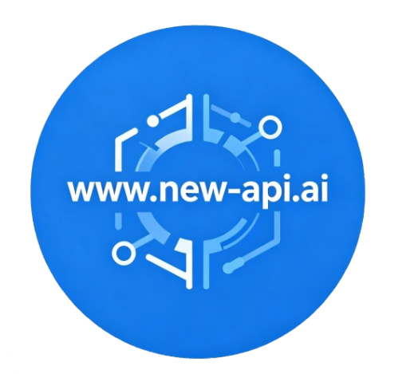

<div align="center">



# OAI Copilot Gateway

**在 VS Code 的 GitHub Copilot Chat 中使用任意 OpenAI/Ollama/Anthropic/Gemini API 兼容供应商** 🔥

[English](README.md) | 简体中文

</div>

[](https://github.com/chukangkang/newapi-copilot-gw/actions)
[](https://github.com/chukangkang/newapi-copilot-gw/blob/main/LICENSE)

## ✨ 特性
- **多 API 支持**：OpenAI/Ollama/Anthropic/Gemini API（ModelScope、SiliconFlow、DeepSeek 等）
- **视觉模型**：完整支持图像理解能力
- **高级配置**：灵活的对话请求选项，支持思维链推理控制
- **多供应商管理**：同时配置多个供应商模型，自动管理各供应商 API 密钥
- **同模型多配置**：为同一模型定义不同参数配置（如 GLM-4.6 开启/关闭思维链）
- **可视化配置界面**：直观的界面管理供应商和模型
- **自动重试**：处理 API 错误（429、500、502、503、504），支持指数退避
- **Token 用量**：状态栏实时显示 token 计数和供应商 API 密钥管理
- **Git 集成**：直接从源代码管理生成提交信息
- **导入/导出**：轻松分享和备份配置
- **工具优化**：优化 agent `read_file` 工具处理，避免对大文件读取小片段

## 环境要求
- VS Code 1.104.0 或更高版本。
- OpenAI 兼容供应商的 API 密钥。

## 🚀 快速开始
1. 安装 OAI Copilot Gateway 扩展（使用 extension.vsix）。
2. 打开 VS Code 设置，配置 `newapicopilot.baseUrl` 和 `newapicopilot.models`。
3. 打开 GitHub Copilot Chat 界面。
4. 点击模型选择器，选择 "Manage Models..."。
5. 选择 "OAI Copilot GW" 供应商。
6. 输入你的 API 密钥——它将保存在本地。
7. 选择你想添加到模型选择器中的模型。

### 配置示例

```json
"newapicopilot.baseUrl": "https://api-inference.modelscope.cn/v1",
"newapicopilot.models": [
    {
        "id": "Qwen/Qwen3-Coder-480B-A35B-Instruct",
        "owned_by": "modelscope",
        "context_length": 256000,
        "max_tokens": 8192,
        "temperature": 0,
        "top_p": 1
    }
]
```

## 📋 配置界面

该扩展提供了一个可视化的配置界面，让您可以轻松管理全局设置、供应商和模型，而无需手动编辑 JSON 文件。

### 打开配置界面

有两种方式可以打开配置界面：

1. **从命令面板**：
   - 按 `Ctrl+Shift+P`（或 macOS 上的 `Cmd+Shift+P`）
   - 搜索 "newapicopilot: Open Configuration UI"
   - 选择命令以打开配置面板

2. **从状态栏**：
   - 点击 VS Code 右下角的 "newapicopilot" 状态栏项目

<details>
<summary>点击查看详细信息</summary>

### 工作流示例

1. **添加供应商**：
   - 在供应商管理部分点击 "Add Provider"
   - 输入供应商 ID："modelscope"
   - 输入基础 URL："https://api-inference.modelscope.cn/v1"
   - 输入 API 密钥：你的 ModelScope API 密钥
   - 选择 API 模式："openai"
   - 点击 "Save"

2. **添加模型**：
   - 在模型管理部分点击 "Add Model"
   - 选择供应商："modelscope"
   - 输入模型 ID："Qwen/Qwen3-Coder-480B-A35B-Instruct"
   - 配置基本参数（上下文长度、最大 token 数等）
   - 点击 "Save Model"

3. **在 VS Code 中使用模型**：
   - 打开 GitHub Copilot Chat（`Ctrl+Shift+I` 或 `Cmd+Shift+I`）
   - 点击聊天输入框中的模型选择器
   - 选择 "Manage Models..."
   - 选择 "OAI Copilot GW" 供应商
   - 选择你配置的模型
   - 开始与模型对话！

### 提示和最佳实践

- **重要**：如果使用配置界面，全局 baseURL 和 API 密钥将失效。
- **供应商 ID**：使用与服务匹配的描述性名称（例如："modelscope"、"iflow"、"anthropic"）
- **模型 ID**：使用供应商文档中确切的模型标识符
- **配置 ID**：使用有意义的名称，如 "thinking"、"no-thinking"、"fast"、"accurate"
- **基础 URL 覆盖**：当使用同一供应商的不同端点时，设置模型特定的基础 URL
- **频繁保存**：更改会立即保存到 VS Code 设置
- **刷新**：使用 "Refresh" 按钮从 VS Code 设置重新加载当前配置

### 模型家族和系统提示

VS Code Copilot 为特定模型优化了系统提示。[详细介绍](https://github.com/microsoft/vscode-copilot-chat/blob/main/docs/prompts.md)

以下是 Copilot 支持的模型家族设置：

| 模型家族 | 通用 `family` | 特定模型 `family` | 备注 |
|---|---|---|---|
| Anthropic | 'claude', 'Anthropic'  | 'claude-sonnet-4-5', 'claude-haiku-4-5' |  |
| Gemini | 'gemini' | 'gemini-3-flash' | "github.copilot.chat.alternateGeminiModelFPrompt.enabled": true |
| xAI | 'grok-code' |  |  |
| OpenAI | 'gpt', 'o4-mini', 'o3-mini', 'OpenAI' | 'gpt-4.1', 'gpt-5-codex', 'gpt-5', 'gpt-5-mini', `!!family.startsWith('gpt-') && family.includes('-codex')`, `!!family.match(/^gpt-5\.\d+/i)` | "github.copilot.chat.alternateGptPrompt.enabled": true |

</details>

## 🔌 多 API 模式

该扩展支持五种不同的 API 协议，可与各种模型供应商配合使用。您可以通过 `apiMode` 参数指定每个模型使用的 API 模式。

### 支持的 API 模式

1. **`openai`**（默认）- OpenAI Chat Completions API
   - 端点：`/chat/completions`
   - 头部：`Authorization: Bearer <apiKey>`
   - 适用于：大多数 OpenAI 兼容供应商（ModelScope、SiliconFlow 等）

2. **`openai-responses`** - OpenAI Responses API
   - 端点：`/responses`
   - 头部：`Authorization: Bearer <apiKey>`
   - 适用于：OpenAI 官方 Responses API（以及兼容网关如 rsp4copilot）

3. **`ollama`** - Ollama 原生 API
   - 端点：`/api/chat`
   - 头部：`Authorization: Bearer <apiKey>`（或无头部用于本地 Ollama）
   - 适用于：本地 Ollama 实例

4. **`anthropic`** - Anthropic Claude API
   - 端点：`/v1/messages`
   - 头部：`x-api-key: <apiKey>`
   - 适用于：Anthropic Claude 模型

5. **`gemini`** - Gemini 原生 API
   - 端点：`/v1beta/models/{model}:streamGenerateContent?alt=sse`
   - 头部：`x-goog-api-key: <apiKey>`
   - 适用于：Google Gemini 模型（以及兼容网关如 rsp4copilot）

<details>
<summary>点击查看详细信息</summary>

### 配置示例
混合配置多种 API 模式：

```json
"newapicopilot.models": [
    {
        "id": "GLM-4.6",
        "owned_by": "modelscope",
    },
    {
        "id": "llama3.2",
        "owned_by": "ollama",
        "baseUrl": "http://localhost:11434",
        "apiMode": "ollama"
    },
    {
        "id": "claude-3-5-sonnet-20241022",
        "owned_by": "anthropic",
        "baseUrl": "https://api.anthropic.com",
        "apiMode": "anthropic"
    }
]
```

### 重要说明
- `apiMode` 参数默认为 `"openai"`（如果未指定）。
- 使用 `ollama` 模式时，可以省略 API 密钥（默认为 `ollama`）或设置为任意字符串。
- 每种 API 模式内部使用不同的消息转换逻辑以匹配供应商特定的格式（工具、图像、思维链）。

</details>

## 🔑 多供应商指南

> 模型配置中的 `owned_by`（别名：`provider` / `provide`）用于分组供应商特定的 API 密钥。存储键为 `newapicopilot.apiKey.<providerIdLowercase>`。

1. 打开 VS Code 设置，配置 `newapicopilot.models`。
2. 打开命令中心（Ctrl+Shift+P），搜索 "newapicopilot: Set OAI Compatible Multi-Provider API Key" 以配置供应商特定的 API 密钥。
3. 打开 GitHub Copilot Chat 界面。
4. 点击模型选择器，选择 "Manage Models..."。
5. 选择 "OAI Copilot GW" 供应商。
6. 选择你想添加到模型选择器中的模型。

<details>
<summary>点击查看详细信息</summary>

### 配置示例

```json
"newapicopilot.baseUrl": "https://api-inference.modelscope.cn/v1",
"newapicopilot.models": [
    {
        "id": "Qwen/Qwen3-Coder-480B-A35B-Instruct",
        "owned_by": "modelscope",
        "context_length": 256000,
        "max_tokens": 8192,
        "temperature": 0,
        "top_p": 1
    },
    {
        "id": "qwen3-coder",
        "owned_by": "iflow",
        "baseUrl": "https://apis.iflow.cn/v1",
        "context_length": 256000,
        "max_tokens": 8192,
        "temperature": 0,
        "top_p": 1
    }
]
```

</details>

## ⚙️ 同模型多配置

您可以使用 `configId` 字段为同一模型 ID 定义多个配置。这允许您为同一基础模型定义不同的设置以用于不同的用例。

<details>
<summary>点击查看详细信息</summary>

要使用此功能：

1. 在您的模型配置中添加 `configId` 字段
2. 具有相同 `id` 的每个配置必须有唯一的 `configId`
3. 模型将在 VS Code 模型选择器中显示为单独的条目

### 配置示例

```json
"newapicopilot.models": [
    {
        "id": "glm-4.6",
        "configId": "thinking",
        "owned_by": "zai",
        "temperature": 0.7,
        "top_p": 1,
        "thinking": {
            "type": "enabled"
        }
    },
    {
        "id": "glm-4.6",
        "configId": "no-thinking",
        "owned_by": "zai",
        "temperature": 0,
        "top_p": 1,
        "thinking": {
            "type": "disabled"
        }
    }
]
```

在此示例中，您将在 VS Code 中有两个不同的 glm-4.6 模型配置：
- `glm-4.6::thinking` - 使用带思维链的 GLM-4.6
- `glm-4.6::no-thinking` - 使用不带思维链的 GLM-4.6

</details>

## 🎯 自定义请求头

您可以指定自定义 HTTP 请求头，这些请求头将随每个请求发送到特定模型的供应商。这对于以下场景非常有用：

- API 版本化头部
- 自定义认证头部（除标准 Authorization 头部外）
- 某些 API 所需的供应商特定头部
- 请求跟踪或调试头部

<details>
<summary>点击查看详细信息</summary>

### 自定义请求头示例

```json
"newapicopilot.models": [
    {
        "id": "custom-model",
        "owned_by": "provider",
        "baseUrl": "https://api.example.com/v1",
        "headers": {
            "X-API-Version": "2024-01",
            "X-Request-Source": "vscode-copilot",
            "Custom-Auth-Token": "additional-token-if-needed"
        }
    }
]
```

**重要说明：**
- 自定义请求头会与默认请求头合并（Authorization、Content-Type、User-Agent）
- 如果自定义请求头与默认请求头冲突，自定义请求头优先
- 请求头按模型应用，允许不同供应商使用不同请求头
- 请求头值必须为字符串

</details>

## 📦 自定义请求体参数

`extra` 字段允许您向 API 请求体添加任意参数。这对于标准参数未涵盖的供应商特定功能非常有用。

### 工作原理
- `extra` 中的参数直接合并到请求体中
- 适用于所有 API 模式（`openai`、`openai-responses`、`ollama`、`anthropic`、`gemini`）
- 值可以是任何有效的 JSON 类型（字符串、数字、布尔值、对象、数组）

<details>
<summary>点击查看详细信息</summary>

### 常见用例
- **OpenAI 特定参数**：`seed`、`logprobs`、`top_logprobs`、`suffix`、`presence_penalty`（如果不使用标准参数）
- **供应商特定功能**：自定义采样方法、调试标志
- **实验性参数**：API 供应商的 Beta 功能

### 配置示例

```json
"newapicopilot.models": [
    {
        "id": "custom-model",
        "owned_by": "openai",
        "extra": {
            "seed": 42,
            "logprobs": true,
            "top_logprobs": 5,
            "suffix": "###",
            "presence_penalty": 0.1
        }
    },
    {
        "id": "local-model",
        "owned_by": "ollama",
        "baseUrl": "http://localhost:11434",
        "apiMode": "ollama",
        "extra": {
            "keep_alive": "5m",
            "raw": true
        }
    },
    {
        "id": "claude-model",
        "owned_by": "anthropic",
        "baseUrl": "https://api.anthropic.com",
        "apiMode": "anthropic",
        "extra": {
            "service_tier": "standard_only"
        }
    }
]
```

### 在 Copilot 中显示思维链
这些是供应商特定的参数，可以让 Copilot 显示 **Thinking** 块（如果供应商/模型支持）。

#### OpenAI Responses
使用 `apiMode: "openai-responses"` 并设置推理摘要模式：

```json
{
  "id": "gpt-4o-mini",
  "owned_by": "openai",
  "baseUrl": "https://api.openai.com/v1",
  "apiMode": "openai-responses",
  "reasoning_effort": "high",
  "extra": {
    "reasoning": {
      "summary": "detailed"
    }
  }
}
```

#### Gemini
使用 `apiMode: "gemini"` 并启用思考摘要：

```json
{
  "id": "gemini-3-flash-preview",
  "owned_by": "gemini",
  "baseUrl": "https://generativelanguage.googleapis.com",
  "apiMode": "gemini",
  "extra": {
    "generationConfig": {
      "thinkingConfig": {
        "includeThoughts": true
      }
    }
  }
}
```

### 重要说明
- `extra` 中的参数在标准参数之后添加
- 如果 `extra` 参数与标准参数冲突，`extra` 值优先
- 仅将此用于供应商特定功能
- 标准参数（temperature、top_p 等）应尽可能使用其专用字段
- API 供应商必须支持您指定的参数

</details>

## 模型参数
所有参数支持针对不同模型进行单独配置，提供高度灵活的模型调优能力。

- `id`（必需）：模型标识符
- `owned_by`（必需）：模型供应商
- `displayName`：将在 Copilot 界面中显示的模型显示名称。
- `configId`：此模型的配置 ID。允许定义具有不同设置的同一模型（例如 'glm-4.6::thinking'、'glm-4.6::no-thinking'）
- `family`：模型家族（例如 'gpt-4'、'claude-3'、'gemini'）。启用模型特定的优化和行为。如果未指定，默认为 'oai-compatible'。
- `baseUrl`：模型特定的基础 URL。如果未提供，将使用全局 `newapicopilot.baseUrl`
- `context_length`：模型支持的上下文长度。默认值为 128000
- `max_tokens`：生成的最大 token 数（范围：[1, context_length]）。默认值为 4096
- `max_completion_tokens`：生成的最大 token 数（OpenAI 新标准参数）
- `vision`：模型是否支持视觉能力。默认为 false
- `temperature`：采样温度（范围：[0, 2]）。控制模型输出的随机性：
  - **较低值（0.0-0.3）**：更专注、一致和确定性。适合精确的代码生成、调试和需要准确性的任务。
  - **中等值（0.4-0.7）**：平衡创造力和结构。适合架构设计和头脑风暴。
  - **较高值（0.7-2.0）**：更具创造性和多样性的响应。适合开放式问题和解释。
  - **最佳实践**：设置为 `0` 以与 GitHub Copilot 的默认确定性行为保持一致，以获得一致的代码建议。启用思维链的模型建议设置为 `1.0` 以确保思维机制的最佳性能。
- `top_p`：Top-p 采样值（范围：(0, 1]）。可选参数
- `top_k`：Top-k 采样值（范围：[1, ∞)）。可选参数
- `min_p`：最小概率阈值（范围：[0, 1]）。可选参数
- `frequency_penalty`：频率惩罚（范围：[-2, 2]）。可选参数
- `presence_penalty`：存在惩罚（范围：[-2, 2]）。可选参数
- `repetition_penalty`：重复惩罚（范围：(0, 2]）。可选参数
- `enable_thinking`：启用模型思维和推理内容显示（适用于非 OpenRouter 供应商）
- `thinking_budget`：思维链输出的最大 token 数。可选参数
- `reasoning`：OpenRouter 推理配置，包括以下选项：
  - `enabled`：启用作理功能（如果未指定，将从 effort 或 max_tokens 推断）
  - `effort`：推理努力级别（high、medium、low、minimal、auto）
  - `exclude`：从最终响应中排除推理 token
  - `max_tokens`：推理的特定 token 限制（Anthropic 风格，作为 effort 的替代）
- `thinking`：Zai 供应商的思维链配置
  - `type`：设置为 'enabled' 以启用思维链，'disabled' 以禁用思维链
- `reasoning_effort`：推理努力级别（OpenAI 推理配置）
- `headers`：自定义 HTTP 请求头，将随每个请求发送到该模型的供应商（例如 `{"X-API-Version": "v1", "X-Custom-Header": "value"}`）。这些请求头将与默认请求头合并（Authorization、Content-Type、User-Agent）
- `extra`：额外的请求体参数。
- `include_reasoning_in_request`：是否在发送到 API 的助手消息中包含 reasoning_content。支持 deepseek-v3.2 和类似模型。
- `apiMode`：API 模式：'openai'（默认）用于 API (/chat/completions)，'openai-responses' 用于 API (/responses)，'ollama' 用于 API (/api/chat)，'anthropic' 用于 API (/v1/messages)，'gemini' 用于 API (/v1beta/models/{model}:streamGenerateContent?alt=sse)。
- `delay`：模型特定的连续请求之间的延迟（毫秒）。如果未指定，回退到全局 `newapicopilot.delay` 配置。
- `useForCommitGeneration`：是否用于 Git 提交信息生成。不支持 gemini apiMode。

## 致谢

感谢所有贡献者。

- [Hugging Face Chat Extension](https://github.com/huggingface/huggingface-vscode-chat)
- [VS Code Chat Provider API](https://code.visualstudio.com/api/extension-guides/ai/language-model-chat-provider)
- [JohnnyZ93/oai-compatible-copilot](https://github.com/JohnnyZ93/oai-compatible-copilot)


## 支持与许可证
- 问题追踪：https://github.com/chukangkang/newapi-copilot-gw/issues
- 许可证：MIT License Copyright (c) 2025 chukangkang
